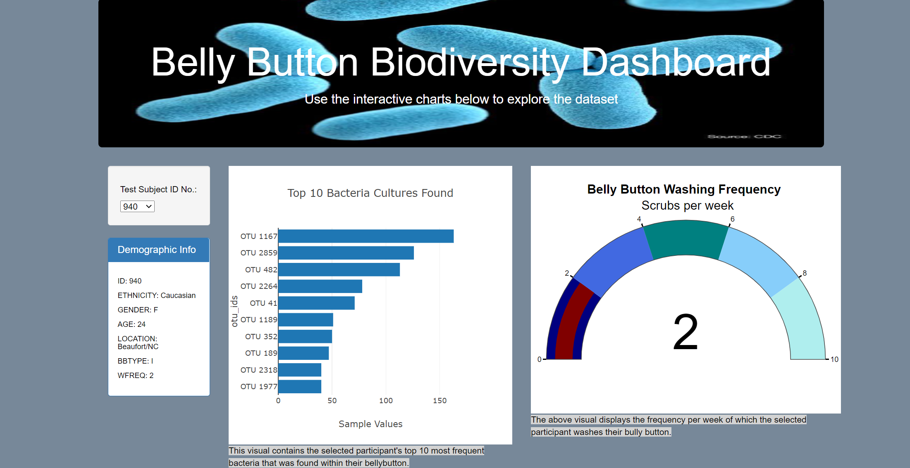
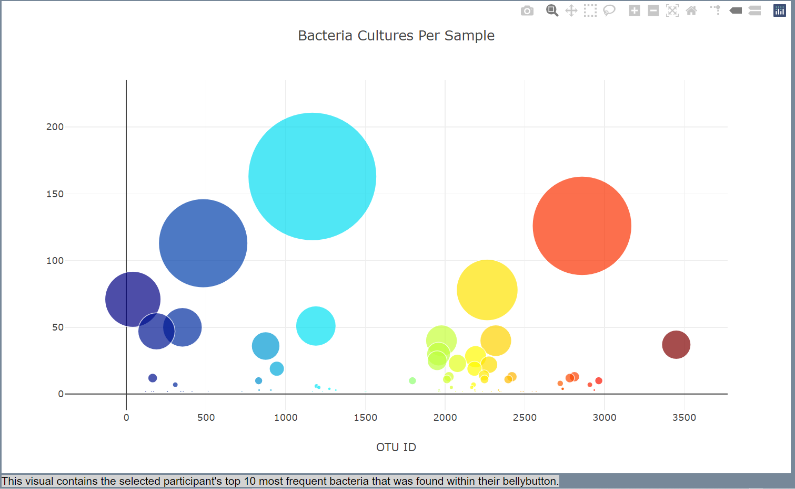

# Bellybutton Diversity Dashboard
---
## Overview
A biology researcher who works in a microbiology laboratory has been tasked with identifying and recording bacteria species that may have the ability to synthesize proteins that taste like beef. The biologist hypothesizes that these bacteria can be found in some human bellybuttons. Thereby, she has decided to take samples of different people's navels. Every participant in the study will have their identity hidden because it is confidential. However, the sample data I present here contains information that substitutes as an ID. 

She has reached out to me and asked that I create a visually appealing front-end website that includes an interactive dashboard so that participants will be able to select their specfic participant ID from a dropdown menu. Then, based on the selected ID #, the dashboard will automatically generate two custom charts displaying the top 10 most frequent bacteria found in their navel and an associated gauge chart. 

If her hypothesis is correct, she will be able to contact whoever possesses this bacteria in their naval and discuss any potential next steps with them. 

## Picture of Dashboard-Top

---
## Picture of Dashboard-Bottom

---
## Tools/Packages Used
* Javascript
  - D3.js
  - Plotly
* HTML/CSS
* Bootstrap
